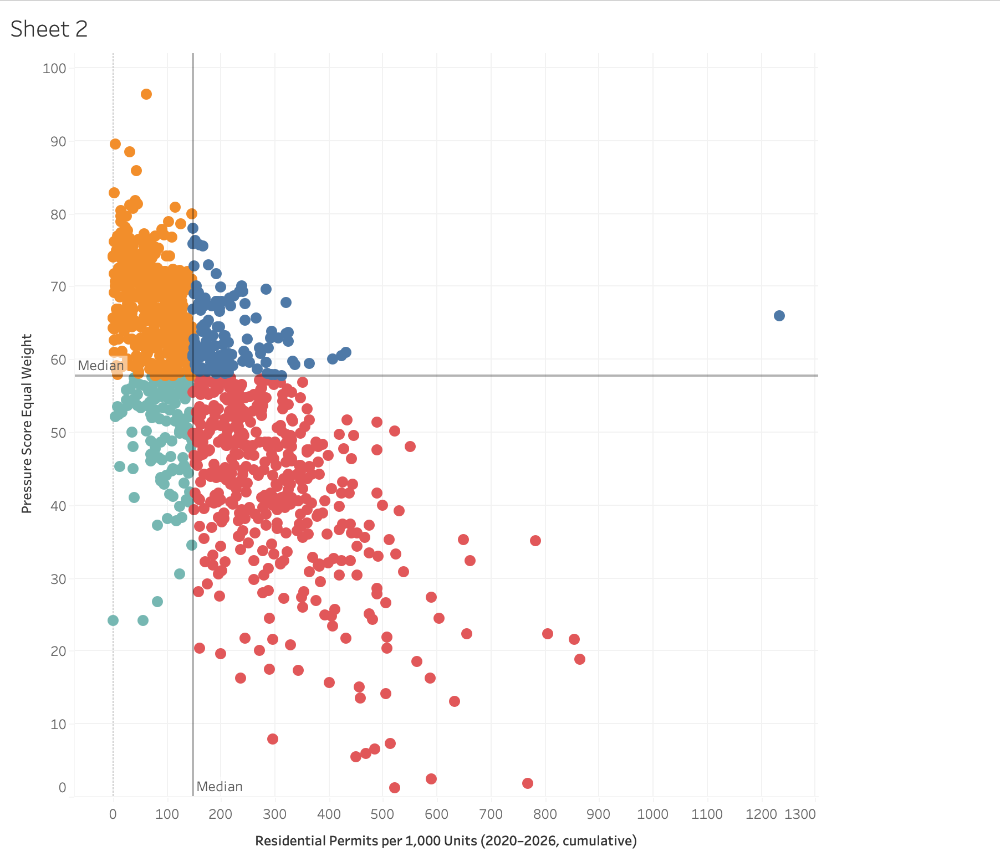

# LA Housing, Development, and Affordability Analytics

Independent public-data analysis. **Not affiliated with the City of Los
Angeles, LADBS, LAHD, LA County, or any government agency.**

Where is housing development activity in the City of Los Angeles
concentrated, and are the areas under the greatest affordability pressure
receiving enough of it?

## Sample Finding: Need vs. Development Gap



Each point is one LA census tract (2020-2026 data), plotted by cumulative
residential permit activity against an independent affordability-pressure
index built from ACS rent-burden, renter-share, and income data. Tracts in
the upper-left (orange) show high affordability pressure paired with
comparatively low development activity -- see `docs/methodology.md` for
how the index is built and `docs/data_dictionary.md` for a real data-quality
issue (a Census sentinel value that was silently corrupting this exact
chart) found and fixed during development.

## Data sources

See [`docs/data_sources.md`](docs/data_sources.md) for full source URLs,
licensing, coverage windows, and caveats. In short:

- LADBS building permits (City of LA Open Data Portal, 2020-present)
- U.S. Census Bureau ACS 5-year estimates (rent burden, income, tenure,
  vacancy), tract-level, LA County

## Project structure

```
data/raw/          # untouched data exactly as pulled from source APIs
data/processed/    # cleaned, standardized, analysis-ready data
src/ingestion/      # scripts that pull data from source APIs
src/validation/     # data-quality checks
sql/schema/         # table definitions (DDL)
sql/staging/        # cleaning/standardization SQL
sql/marts/          # final analytical tables (facts/dims)
sql/analysis/        # analysis queries answering the project's questions
notebooks/          # exploratory analysis, geospatial prep, validation
dashboard/          # Tableau workbook + exports
docs/               # data sources, methodology, data dictionary
tests/              # automated tests for the pipeline
```

## Setup

1. Clone this repo and `cd` into it.
2. Create and activate a virtual environment:
   ```
   python -m venv .venv
   # Windows:
   .venv\Scripts\activate
   # Mac/Linux:
   source .venv/bin/activate
   ```
3. Install dependencies:
   ```
   pip install -r requirements.txt
   ```
4. Copy `.env.example` to `.env` and fill in your own free API keys
   (Census API key, LA Open Data app token). `.env` is gitignored and will
   never be committed.
5. Run the ingestion scripts:
   ```
   python src/ingestion/fetch_ladbs_permits.py --inspect
   python src/ingestion/fetch_census_acs.py --year 2023
   ```

## Methodology, limitations, and findings

_To be written once the analysis is complete -- will include the
data-quality exclusion counts, the affordability-pressure index definition
and sensitivity check, and the actual answers to the project's core
questions._
